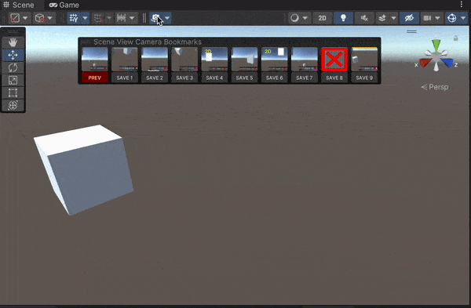

# Unity.SceneBookmarks

[](https://opensource.org/licenses/MIT)

A simple unity editor tool to provide basic bookmarking for scene view camera positions.

[CHANGELOG](https://github.com/superkerokero/Bookmark4Unity/blob/master/Assets/Bookmark4Unity/CHANGELOG.md)

## Installation

Add the dependency to your `manifest.json`

```json
{
  "dependencies": {
    "jd.boiv.in.scene-bookmarks": "https://github.com/starburst997/Unity.SceneBookmarks.git"
  }
}
```

## Supported unity version

- 2021.3~

## Basic usage

### Bookmarking scene view camera positions



- Enable the overlay
  - Press `space`(for 〜Unity2021.3)/`｀`(for Unity2022.3〜) inside the scene view to bring up overlay visibility menu, and turn `Bookmark4Unity` on
  - The new camera icon will appear on the top of scene view, click it to toggle the scene view bookmark overlay window
- Using the overlay
  - You can bookmark/restore camera positions by clicking corresponding slot buttons
  - The camera icon also provides a dropdown menu for bookmarking/restoring camera positions
- Using menu items(and keyboard shortcuts)
  - Alternatively, you can access the same dropdown menu from `Tools` → `Bookmark4Unity` → `Scene View Bookmarks`
  - The dropdown menu and keyboard shortcuts works even when the scene view overlay is off

## Credits

Fork of [superkerokero/Bookmark4Unity](https://github.com/superkerokero/Bookmark4Unity)

## LICENSE

The bookmark editor tool itself is distributed under MIT license. However, it uses a modified version of cross scene reference to provide scene objects bookmarking, which is under [Unity Companion License](http://www.unity3d.com/legal/licenses/Unity_Companion_License) . Since this tool can't be used outside of unity anyway, feel free to do whatever you want with it.
